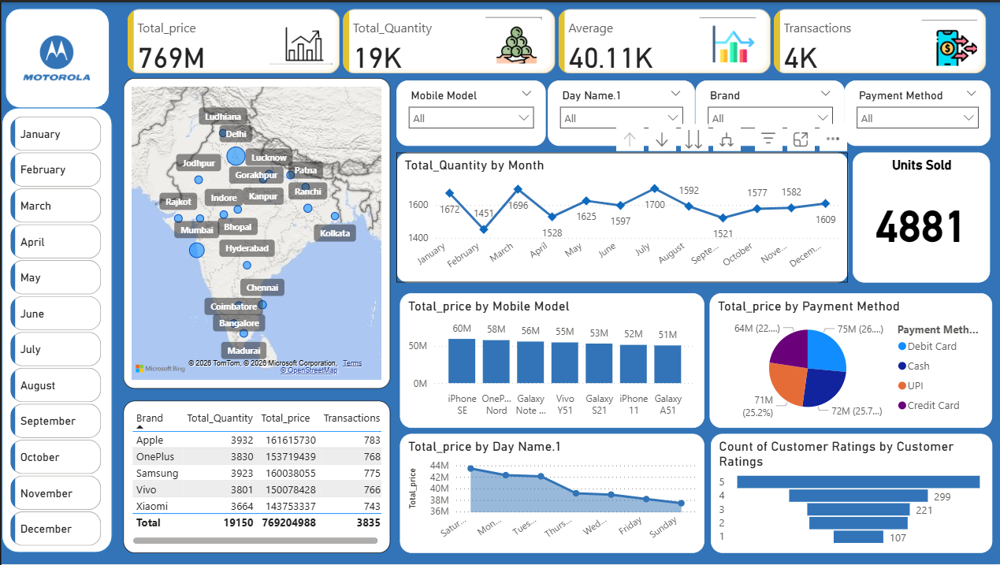

# First-Dashboard---Guided-project
# 📱 Mobile Sales Dashboard (Power BI)

## 📌 Project Overview

This project is an interactive Power BI dashboard built to analyze mobile phone sales performance across different regions, products, customers, and time periods.

The dashboard provides a comprehensive view of sales trends, customer purchasing behavior, product performance, and revenue generation through dynamic visualizations and KPI tracking.

This project was developed as part of my Power BI learning journey to gain hands-on experience in dashboard development, data modeling, visualization design, and business intelligence reporting.

---

## 🛠️ Tech Stack

- Power BI
- Power Query
- DAX (Data Analysis Expressions)
- Data Modeling
- Microsoft Excel / CSV Dataset

---

## 📊 Dashboard Features

### Executive KPIs
- Total Sales
- Total Quantity Sold
- Average Selling Price
- Total Transactions

### Sales Analysis
- Revenue trends over time
- Monthly and yearly sales performance
- Sales distribution across products

### Product Performance
- Best-selling mobile brands
- Top-performing products
- Revenue contribution by product category

### Customer Insights
- Customer purchase patterns
- Customer segmentation analysis
- Transaction behavior analysis

### Geographic Analysis
- Regional sales performance
- Location-wise revenue contribution
- Market performance comparison

### Interactive Filters
- Date slicers
- Product filters
- Region filters
- Customer-level drilldowns

---

## 📈 Key Insights Generated

- Identified top-performing products and brands.
- Analyzed revenue contribution across different regions.
- Evaluated customer purchasing trends.
- Tracked sales growth over time.
- Compared sales performance across multiple dimensions.

---

## 🧠 Power BI Concepts Used

### Data Preparation
- Data Cleaning
- Data Transformation
- Power Query Operations

### Data Modeling
- Relationships
- Star Schema Concepts
- Fact and Dimension Tables

### DAX Measures
- Total Sales
- Average Sales
- Growth Metrics
- KPI Calculations

### Visualizations
- KPI Cards
- Bar Charts
- Line Charts
- Pie Charts
- Slicers
- Interactive Dashboards

---

## 🚀 Skills Demonstrated

- Business Intelligence
- Dashboard Design
- Data Visualization
- Power BI Development
- DAX Fundamentals
- Data Modeling
- Data Storytelling
- KPI Reporting
  
---
## 📸 Dashboard Preview

### Dashboard Overview

---

## 📂 Repository Contents

- `mobile_sales_dashboard.pbix` → Power BI dashboard file
- `README.md` → Project documentation
- `dashboard_overview.png` → Dashboard screenshot
- Dataset (if permitted)

---

## 🎯 Learning Outcome

Through this project, I developed practical experience with Power BI's end-to-end workflow, including data preparation, modeling, DAX calculations, dashboard design, and business reporting.

This project served as a foundation for building more advanced analytics dashboards and business intelligence solutions.

---

## 👤 Author

**Kavya Shah**

Aspiring Data Analyst | SQL | Power BI | Business Analytics

GitHub: https://github.com/KavyaShah1234
